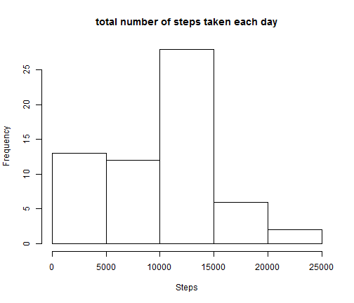
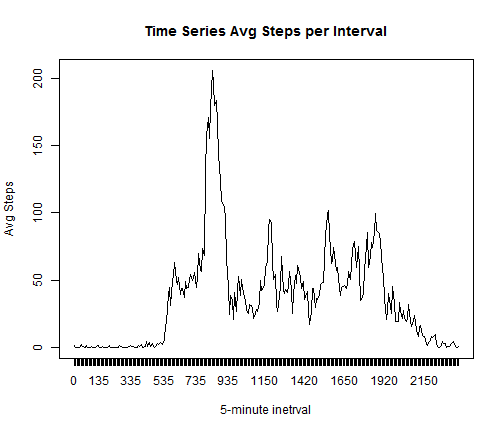
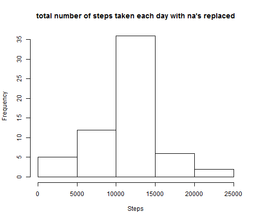
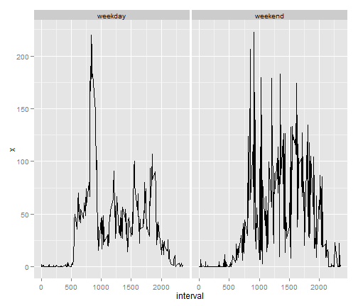

Peer-Graded Assignment 1
========================================================

This is an R Markdown document. Markdown is a simple formatting syntax for authoring web pages (click the **Help** toolbar button for more details on using R Markdown).

When you click the **Knit HTML** button a web page will be generated that includes both content as well as the output of any embedded R code chunks within the document. You can embed an R code chunk like this:

Loading and preprocessing the data:

```r
activity <- read.csv("C:/Users/gbeyderman/Downloads/repdata-data-activity/activity.csv")
tidyactivity<-aggregate(activity$steps, by=list(Category=activity$date), FUN=sum, na.rm=TRUE)
```


What is mean total number of steps taken per day?
A histogram of the total number of steps taken each day:

```r
with(tidyactivity, hist(tidyactivity$x, ylab="Frequency", xlab="Steps", main="total number of steps taken each day"))
```

 


Calculate and report the mean and median total number of steps taken per day

```r
mean(tidyactivity$x)
```

```
## [1] 9354
```

```r
median(tidyactivity$x)
```

```
## [1] 10395
```


What is the average daily activity pattern?
 
Make a time series plot (i.e.  type = "l" ) of the 5-minute interval (x-axis) and the average number of steps taken, averaged across all days (y-axis)

```r
tidyactivityint<-aggregate(activity$steps, by=list(interval=activity$interval), FUN=mean, na.rm=TRUE)
with(tidyactivityint, plot(tidyactivityint$x,type="l", xaxt="n", ylab="Avg Steps", xlab="5-minute inetrval", main="Time Series Avg Steps per Interval"))
axis(1,at=c(1:288),labels=tidyactivityint$interval)
```

 


Which 5-minute interval, on average across all the days in the dataset, contains the maximum number of steps?

```r
tidyactivityint[which.max(tidyactivityint$x),1]
```

```
## [1] 835
```


Calculate and report the total number of missing values in the dataset (i.e. the total number of rows with  NA s)

```r
m<-is.na(activity$steps)
length(m[m==TRUE])
```

```
## [1] 2304
```


Devise a strategy for filling in all of the missing values in the dataset. The strategy does not need to be sophisticated. For example, you could use the mean/median for that day, or the mean for that 5-minute interval, etc.

Create a new dataset that is equal to the original dataset but with the missing data filled in.

```r
activityWithAVG<-plyr::join(activity, tidyactivityint, by="interval")
activityWithAVG$steps[is.na(activity$steps)]<-activityWithAVG$x
```

```
## Warning: number of items to replace is not a multiple of replacement
## length
```

```r
activityWithAVG<-subset(activityWithAVG, select=c(steps, date, interval))
```


Make a histogram of the total number of steps taken each day and Calculate and report the mean and median total number of steps taken per day. Do these values differ from the estimates from the first part of the assignment? What is the impact of imputing missing data on the estimates of the total daily number of steps?

```r
tidyactivity<-aggregate(activityWithAVG$steps, by=list(Category=activityWithAVG$date), FUN=sum, na.rm=TRUE)
with(tidyactivity, hist(tidyactivity$x, ylab="Frequency", xlab="Steps", main="total number of steps taken each day with na's replaced"))
```

 

```r
mean(tidyactivity$x)
```

```
## [1] 10766
```

```r
median(tidyactivity$x)
```

```
## [1] 10766
```


Are there differences in activity patterns between weekdays and weekends?

Create a new factor variable in the dataset with two levels -- "weekday" and "weekend" indicating whether a given date is a weekday or weekend day.

```r
activityWithAVG$date<-as.Date(activityWithAVG$date)
activityWithAVG$day<-weekdays(activityWithAVG$date)
weekend<-c("Saturday","Sunday")
activityWithAVG$daytype<-activityWithAVG$day 
activityWithAVG$daytype[which(activityWithAVG$day==weekend)]<-"weekend"
activityWithAVG$daytype[which(activityWithAVG$day!=weekend)]<-"weekday"
tidyactivityint<-aggregate(activityWithAVG$steps, by=list(interval=activityWithAVG$interval, daytype=activityWithAVG$daytype), FUN=mean)
qplot(interval, x, data = tidyactivityint, facets=.~daytype, geom="line")
```

 
